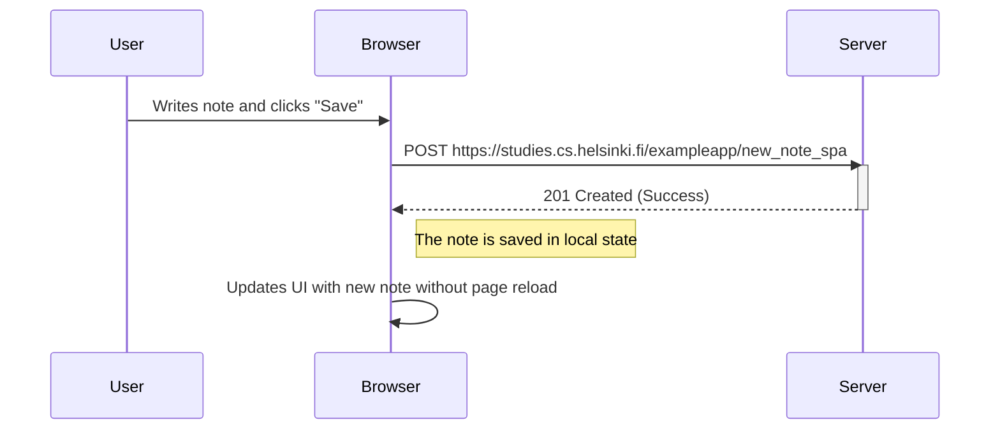

```mermaid
sequenceDiagram
    participant User
    participant Browser
    participant Server

    User->>Browser: Writes note and clicks "Save"
    Browser->>Server: POST https://studies.cs.helsinki.fi/exampleapp/new_note_spa
    activate Server
    Server-->>Browser: 201 Created (Success)
    deactivate Server

    Note right of Browser: The note is saved in local state

    Browser->>Browser: Updates UI with new note without page reload
```